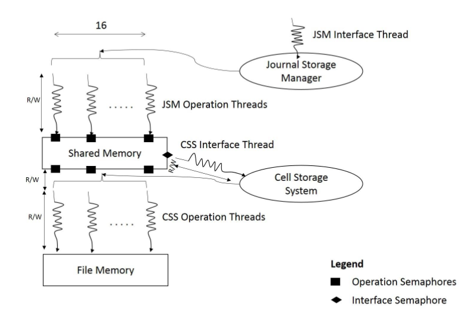

# RamDisk
## Summary
- A simple ramdisk that provides
   - A user interface CLI process for the user to create files, write and read.
   - Another process that runs in the background which facilitates, creation of these files, storing and retrieving data.
- The User interface CLI is called the Journal Storage Manager and the background process is called Cell Storage System. An overview of the same is shown in the image below.

- More details are in the [Report](docs/asu_report.pdf)

## Build and Run
### Make
- Run the following to build
   - `make css` - Creates a file `css.out`
   - `make jsm` - Creates a file `jsm.out`
- More make targets can be found in the [Makefile](src/Makefile)

### Run
- Run the CSS in one terminal first - `./css.out`
- Run the JSM next in another terminal - `./jsm.out`
- The rest is self-explanatory

## Known issues
1. Shared memory and file memory allocated aren't freed when the processes areterminated.
2. Not consistently reproducible, but sometimes, the data read from a file doesn't get displayed correctly.
